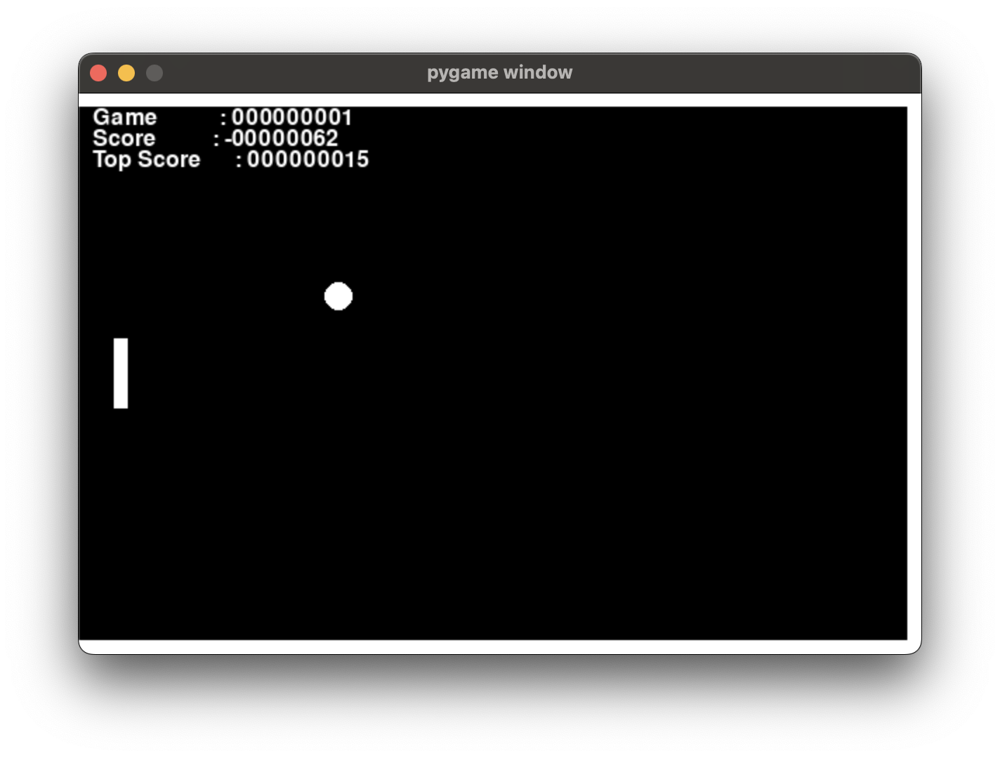
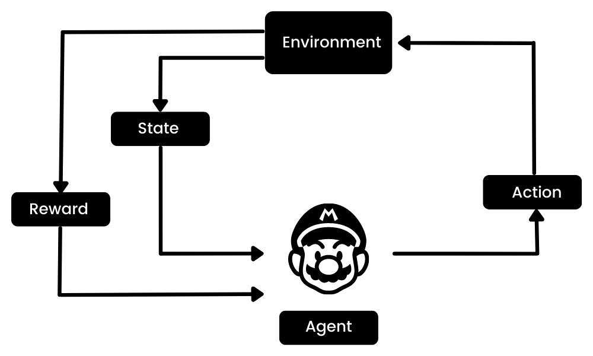
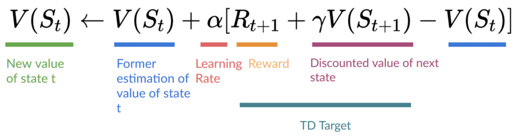

# airummikub

airummikub is a personal project containing some experiments related to Reinforcement Learning. I figured starting with Rummikub is a bit too ambitious, so I started with a simple game of Pong.

It uses `pygame` for the game. The agents currently implemented are:

- Random Agent: Just moves the paddle randomly.
- Q-Learning Agent: Uses Q-Learning to learn the optimal policy.
- Deep Q-Learning Agent: Uses Deep Q-Learning to learn the optimal policy.

For my personal documentation, I quickly describe how the game is built and how the agents are implemented. I also provide some results and thoughts on the experiments.

## Table of Contents

- [airummikub](#airummikub)
  - [Table of Contents](#table-of-contents)
  - [Pong](#pong)
    - [Playing the game](#playing-the-game)
    - [Reward System](#reward-system)
  - [Random Agent](#random-agent)
  - [Q-Learning Agent](#q-learning-agent)
  - [Deep Q-Learning Agent](#deep-q-learning-agent)

## Pong

It appears that even Pong was too ambitious for me. No kidding, I modified it such that the game works for a single player. This means that the ball bounces off the top, bottom, and right walls, but not the left wall. The player has to move the paddle to hit the ball.



### Playing the game

The game actually listens to keyboard inputs. The player can move the paddle up and down using the arrow keys.

You can run the game using the following command:

```bash
python -m src.pong
```

### Reward System

The reward system is simple, and calculated each tick. The reward is calculated as follows:

- If the paddle is in center of the ball, the reward is 5.
- If not, the reward is -1.
- When the ball hits the paddle, the reward is 100.
- When the ball hits the left wall, the reward is -1000 (game over).

This reward system is designed to encourage the agent to keep the paddle in the center of the ball. It is kept equivalent for all agents.

During each game, the current score is shown in the top left corner. In addition, it keeps track of the highest score achieved by the agent which is also shown.

## Random Agent

The Random Agent is the simplest agent. It just moves the paddle randomly. It is implemented in the `RandomDirectionAgent` class in `src/agents/random_direction.py`.

Don't even bother running this agent. It's just for demonstration purposes - the baseline.

## Q-Learning Agent

The `QLearningAgent` class, located in `src/agents/q_learning.py`, implements the Q-Learning algorithm to discover the optimal policy.

The objective of Q-Learning is to learn a policy that guides the agent on which actions to take in different situations. It learns the optimal policy by interacting with the environment.



Simplified it works as follows:

1. Initialize the Q-Table with random values.
2. Choose an action based on the current state.
3. Take the action and observe the reward and the new state.
4. Update the Q-Table based on the reward and the new state.
5. Repeat until the agent has learned the optimal policy.



## Deep Q-Learning Agent

The `DeepQLearningAgent` class, located in `src/agents/deep_q_learning.py`, implements the Deep Q-Learning algorithm to discover the optimal policy. Deep Q-Learning uses uses a neural network to approximate Q-values, enabling it to handle complex and high-dimensional state spaces. This approach scales better and can generalize from seen states to unseen states, making it more efficient and effective in diverse environments.

In my example this can be seen by the way the state is represented. With the regular Q Learning I had to discretize the state space by dividing it into intervals of 5 to make it manageable. With Deep Q-Learning allows me to directly utilize the raw, continuous state space. This can also be seen that the paddle moves a lot more smoothly and accurately.
